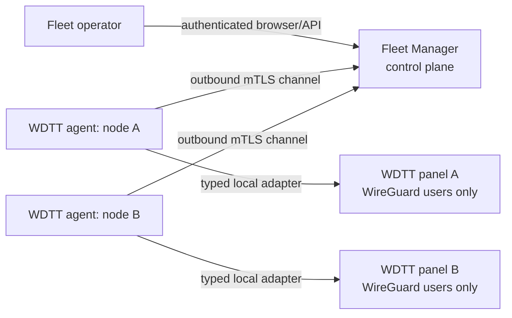

# Architecture: WDTT Fleet Manager

## Purpose and boundary

WDTT Fleet Manager is a central control plane for a fleet of independently deployed WDTT Control Panel instances. Each instance remains the authority for its local WireGuard state. The central service coordinates the limited user-management and telemetry interface below; it never receives shell access and has no endpoint for Xray, WARP, package management, arbitrary process execution, filesystem access, or raw WireGuard configuration.

The first implementation targets a single central deployment and an outgoing node-agent connection. A node must not require a public administrative HTTP listener.

## Trust and connection model

The preferred transport is a persistent outbound mTLS stream (WebSocket, HTTP/2 or a small purpose-built stream). Long polling is an acceptable initial fallback: the agent initiates every request and obtains only commands addressed to its own identity. The central service never connects directly to a node.

Every enrolled node has an immutable `node_id`, a mutable unique display `label`, an active certificate/public-key identity and lifecycle state (`active`, `revoked`). The certificate subject is bound to `node_id`; a request may never choose another node in its JSON body. The central service stores certificate fingerprints and key-rotation history. Operators enroll a node using a one-use, short-lived enrollment grant and approve its public key; the returned bootstrap material is consumed once and is never logged.

The current development scaffold implements the grant lifecycle and an in-memory, hashed bearer bootstrap credential. `POST /v1/enrollment-grants` is operator-authenticated; `POST /v1/agent/enroll` consumes the grant exactly once and returns the agent credential once. The same temporary credential can be explicitly rotated or revoked. It exists solely to exercise the protocol before mTLS termination and persistent secret storage are added; deployment must not treat it as a replacement for mTLS.

Key rotation overlaps the old and new certificate for a short, configured window. Revocation immediately prevents polling and command acknowledgement. Node health derives from authenticated heartbeat receipts: `last_seen_at`, reported agent/panel protocol versions and a computed availability state. A stale node is read-only in the UI and all new mutations are rejected or held pending according to the operation policy.

## Protocol and commands

All messages have an explicit protocol version, for example `wdtt-fleet/v1`. Unsupported major versions fail closed. Additive fields and minor versions are ignored only where documented; agents send their supported version range during heartbeat.

The central service emits a deliberately small command union:

| Kind | Intent | Idempotency key |
| --- | --- | --- |
| `user.create` | Create a WireGuard/WDTT user | central command ID |
| `user.update` | Change allowed user fields | central command ID + expected revision |
| `user.delete` | Remove a user | central command ID |
| `user.read` | Refresh a user record | central command ID |
| `node.snapshot.read` | Refresh users and node status | central command ID |

There is no command escape hatch. Payload schemas prohibit unknown operation names and reject fields outside the WDTT user contract. An agent stores completed command IDs durably and returns the original result on replay. The central side also de-duplicates a client mutation by `idempotency_key`; it never issues two active commands for the same key. Commands are immutable, ordered per node only where required, time-bounded, auditable and transition through `queued → delivered → succeeded|failed|expired`.

An agent reports command results and telemetry with an event ID. Receipt is idempotent. Results include sanitized error codes, not server logs or secrets.

## Data model

The production database will contain the following core records:

| Record | Key / constraints | Notes |
| --- | --- | --- |
| `nodes` | immutable UUID; unique normalized label | lifecycle, last seen, protocol versions |
| `node_identities` | node ID + certificate fingerprint | valid window, rotation/revocation audit |
| `fleet_users` | **unique (`node_id`, `source_user_id`)** | cached read model, never globally assumes name uniqueness |
| `user_devices` | node ID + source user ID + source device ID | device/public-key metadata allowed by WDTT |
| `user_usage_snapshots` | node ID + source user ID + captured time | traffic and handshake-derived online state |
| `commands` | immutable UUID; unique client idempotency key | command payload digest, state and result |
| `command_receipts` | command ID + node ID | delivery/agent execution record |
| `audit_events` | append-only UUID | actor, node, target, before/after redacted metadata |

User labels stay a user property and node labels stay a node property: both are returned in fleet user views. `source_user_id` is the local WDTT identifier and remains opaque to the central service. Availability is explicit rather than inferred from stale telemetry.

## Operations while a node is unavailable

Reads display the most recent snapshot with its capture time and an unavailable/stale indicator. Mutations default to rejecting stale nodes before command creation. A later explicit `queue_when_offline` operator policy may permit only idempotent user updates/deletes with a short expiry; it must be visible in the audit trail and cancelable before delivery. Creates are not automatically retried after an ambiguous timeout unless the agent proves the command ID has not run.

## WDTT Control Panel integration (later)

The existing WDTT project should gain three isolated modules, behind an opt-in configuration flag and without changing Xray/WARP code paths:

1. A local **user operations service** that performs existing WDTT/WireGuard user actions through a shared typed interface, validates allowed fields and preserves local authorization/business rules.
2. A **status/telemetry service** that returns normalized users, labels, devices, expiry, traffic and recent-WireGuard-handshake online state. It returns no arbitrary configuration or secrets.
3. An outbound **fleet agent** that authenticates to Fleet Manager, translates only the versioned command union, persists idempotency receipts, sends heartbeat/snapshots, and has no shell/subprocess command interface.

The agent should call the local service in-process or through a loopback-only private adapter; it must not turn the current WDTT web API into a public fleet-administration API.

## Migration and compatibility

1. Add the local service and agent disabled by default; existing panel behavior is unchanged.
2. Ship read-only snapshot support first and verify version/identity/telemetry on a test node.
3. Enable user mutations behind a per-node feature flag after a successful read-only period.
4. Maintain protocol support for at least the current and immediately previous major agent version during upgrades. The center rejects incompatible nodes with a clear upgrade-required state.
5. Use expand/contract database migrations: add nullable fields and dual reads/writes first, backfill, then enforce constraints in a later release. Never auto-enroll existing panels or silently rotate credentials.

## Security defaults

- Fail closed when operator or agent authentication is absent.
- Terminate mTLS at a trusted component and pass verified node identity only over a private channel.
- Store private keys in a secret manager; logs, audit events and command results are redacted.
- Enforce rate limits, request size limits, timeouts, replay protection and per-node authorization.
- Require an authenticated, audited operator action for node enrollment, rotation, label change and revocation.
- Treat the central cached user view as sensitive operational data; minimize retention and restrict export.
