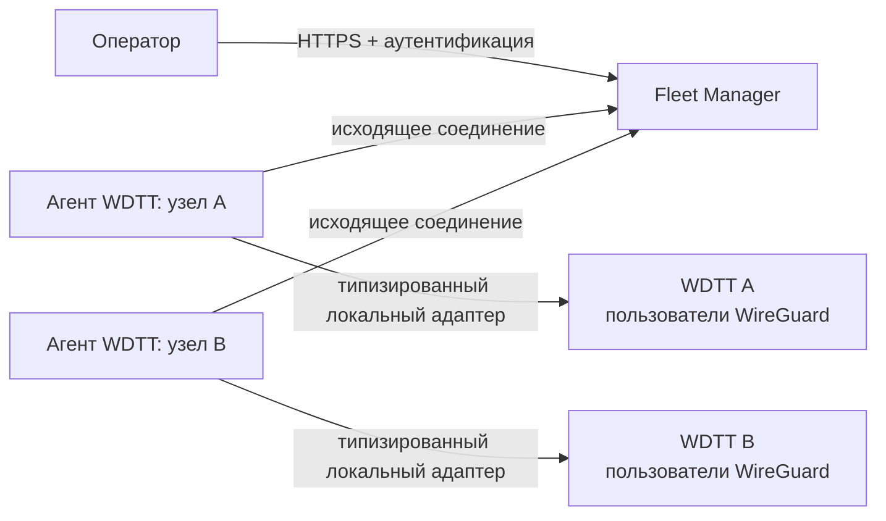
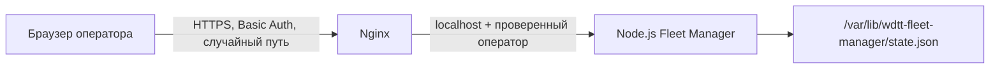

# Архитектура WDTT Fleet Manager

## Назначение и границы

WDTT Fleet Manager — центральная плоскость управления независимыми экземплярами WDTT Control Panel. Каждый узел остаётся источником истины для локального WireGuard/WDTT-состояния. Центр получает нормализованные снимки и отправляет небольшой список типизированных команд пользователям.

Центр **не** получает shell-доступ, не выполняет произвольные процессы, не читает файлы, не меняет raw-конфигурацию WireGuard и не имеет endpoint'ов для Xray, WARP, пакетов или управления хостом.

Центр никогда не устанавливает соединение с узлом. Агент сам регистрируется, отправляет heartbeat/снимки и забирает только собственные команды. Долгий polling — начальный транспорт; постоянный исходящий mTLS-канал — целевой.

## Web-панель и установка

Пользовательский интерфейс состоит из разделов **Обзор**, **Узлы**, **Пользователи** и **Команды**. Он не интерпретирует серверные логи и не содержит скрытых административных действий.

Установщик строит публичную схему, совпадающую по принципу с WDTT Control Panel:

Nginx открывает HTTPS-порт и публикует два случайных пути: операторскую панель с Basic Auth и отдельный адрес агента. Процесс Node.js слушает loopback и поэтому не может быть вызван снаружи в обход Nginx. На адресе агента Nginx принудительно удаляет операторский заголовок: агент получает доступ только по своему гранту или токену. Заголовок оператора принимается только за операторским Nginx-маршрутом (`TRUST_PROXY_ADMIN=true`); при запуске без Nginx API остаётся fail-closed, пока не задан `ADMIN_API_TOKEN`.

## Регистрация и идентичность узла

1. Оператор создаёт грант с уникальной меткой и сроком не более 24 часов; по умолчанию — 15 минут.
2. Агент один раз обменивает грант и SHA-256 fingerprint своей идентичности на неизменяемый `node_id` и временный токен агента.
3. В памяти и в state-файле хранится только SHA-256 токена, не его исходное значение.
4. Агент использует токен для heartbeat, polling команд, снимков и квитанций.
5. Ротация инвалидирует старый токен сразу; отзыв узла блокирует и токены, и создание новых команд.

Метка узла уникальна, fingerprint тоже уникален. Имя пользователя не является глобальным ключом: пользователь идентифицируется парой **(`node_id`, `source_user_id`)**.

Текущий Bearer-токен — промежуточный механизм для обкатки протокола. Production-цель: mTLS с сертификатом, привязанным к `node_id`, короткой фазой перекрытия ключей, отзывом и журналом ротации.

## Протокол

Все сообщения содержат версию `wdtt-fleet/v1`. Несовместимая версия отклоняется до выполнения действия.

### Операторские команды

| Команда | Разрешённые данные |
| --- | --- |
| `user.create` | `sourceUserId`, отображаемое имя, метка, срок, лимит трафика, включённость |
| `user.update` | `sourceUserId`, обязательная ревизия, одно или несколько разрешённых изменений |
| `user.delete` | `sourceUserId` |
| `user.read` | `sourceUserId` |
| `node.snapshot.read` | пустой объект |

Неизвестные поля, произвольные операции и командные строки отклоняются на центре. Ключ идемпотентности возвращает первоначальную команду при повторной отправке. Команда имеет срок жизни и состояние `queued → delivered → succeeded|failed|expired`.

Агент сообщает квитанцию только для команды своего узла. Ошибка — короткий документированный код; логи, пути, секреты и вывод программ не передаются.

### Снимок пользователей

Снимок содержит ограниченный набор полей: локальный ID, имя, пользовательскую метку, флаг доступа, срок, счётчики входящего/исходящего трафика, online, устройства и ревизию. `online` вычисляет локальная WDTT-панель по свежему WireGuard handshake. Private keys, конфигурации, токены, raw-метрики хоста и Xray/WARP-данные запрещены.

Снимок заменяет read-model данного узла целиком. В UI всегда показывается `capturedAt`, чтобы устаревшие данные нельзя было принять за текущие.

## Хранилище и развитие

Первый развёртываемый вариант использует атомарный JSON-файл с правами `0600`: узлы, хеши агентских токенов, незавершённые команды и последний снимок переживают перезапуск. Это не кластерное хранилище и не полноценный audit trail.

Перед production-эксплуатацией требуется переход на PostgreSQL и append-only аудит:

| Сущность | Ограничение |
| --- | --- |
| `nodes` | неизменяемый UUID, уникальная нормализованная метка |
| `node_identities` | `node_id` + fingerprint, период действия, отзыв |
| `fleet_users` | уникальная пара `node_id`, `source_user_id` |
| `user_devices` | узел + пользователь + локальный ID устройства |
| `user_usage_snapshots` | узел + пользователь + время снимка |
| `commands` | UUID, уникальный client idempotency key |
| `command_receipts` | команда + узел |
| `audit_events` | append-only событие с актором и редактированными данными |

## Поведение при недоступном узле

UI оставляет последний снимок и время его получения. Новая команда доступна лишь активному, неотозванному узлу; политика постановки мутаций для offline-узлов будет отдельной, явной и аудируемой. Создание пользователя не повторяется автоматически после неоднозначного тайм-аута.

## Интеграция в WDTT Control Panel

В исходную WDTT-панель нужно добавить только три opt-in модуля, не трогая Xray/WARP:

1. Локальный сервис пользовательских операций с общей типизированной моделью.
2. Сервис статуса, который формирует разрешённый снимок пользователей.
3. Исходящий агент Fleet Manager с durable-квитанциями и проверкой версии/срока команды.

Подробный контракт — в [wdtt-integration-contract.md](wdtt-integration-contract.md).

## Безопасные значения по умолчанию

- API оператора и агента fail-closed.
- Тело запроса ограничено 1 МБ; список пользователей в одном снимке — 500.
- Секреты показываются только при первичной выдаче, не попадают в state-файл и UI-историю.
- Nginx выдаёт `404` вне секретного пути и завершает TLS до приложения.
- mTLS, OIDC/сессии вместо Basic Auth, rate limiting, резервные копии и аудит — обязательные следующие production-работы.
